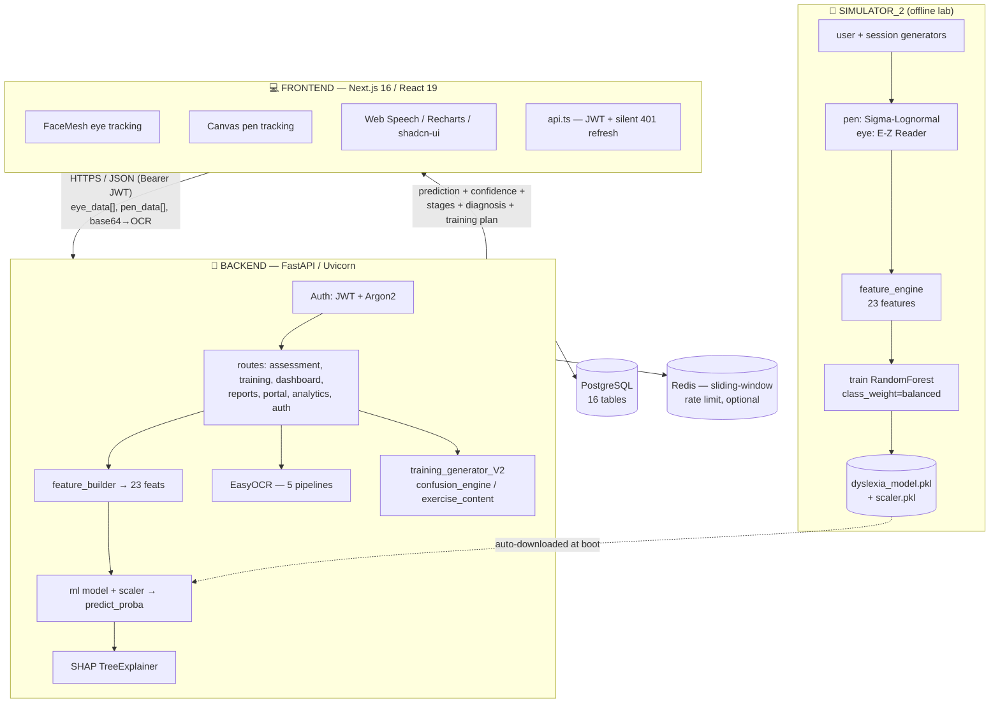

# MENTIS — V_1

> AI-powered screening and adaptive training platform for **Dyslexia** and **Dysgraphia**, driven by **webcam eye-tracking**, **pen/handwriting kinematics**, and **handwriting OCR** — with explainable ML (SHAP), longitudinal tracking, a personalised daily training engine, and a multi-role (parent / teacher / doctor) portal.

`V_1` is a monorepo with **three pillars**:

| Pillar | Path | What it is |
|---|---|---|
| 🧪 **Simulator / ML lab** | `Simulator_2/` | A scientifically-grounded synthetic data generator + the model trainer. It manufactures the 23-feature dataset (5,000 users, 58,140 sessions) and trains the RandomForest the product runs on. |
| 🧠 **Backend** | `Product/backend/` | FastAPI service: auth, assessment capture & inference, ML + SHAP, OCR, adaptive training, dashboards, reports, analytics, portal. |
| 💻 **Frontend** | `Product/frontend/` | Next.js 16 + React 19 app: marketing site (scroll-story), assessment capture (webcam + canvas), training runner, dashboards, reports, portal. |

> **Disclaimer first, because it matters:** MENTIS V_1 is a **screening and training aid**, *not* a medical diagnostic device. The model is trained on **synthetic, literature-calibrated data** (honest 78.2% accuracy). Every output is designed to *flag risk and drive practice*, and should be confirmed by a qualified professional.

---

## Table of Contents
1. [The Problem & Our Answer](#1-the-problem--our-answer)
2. [System Architecture (Tech Flow)](#2-system-architecture-tech-flow)
3. [Repository Layout (Every Folder & File)](#3-repository-layout-every-folder--file)
4. [End-to-End Workflow (Step by Step)](#4-end-to-end-workflow-step-by-step)
5. [The ML / Data-Science Story (Simulator_2)](#5-the-ml--data-science-story-simulator_2)
6. [The 23-Feature Engine (Deep Dive)](#6-the-23-feature-engine-deep-dive)
7. [The Inference & Intelligence Pipeline (`/submit` line-by-line)](#7-the-inference--intelligence-pipeline-submit-line-by-line)
8. [The Adaptive Training Engine (Deep Dive)](#8-the-adaptive-training-engine-deep-dive)
9. [The OCR Subsystem (Deep Dive)](#9-the-ocr-subsystem-deep-dive)
10. [Every API Endpoint (with payloads)](#10-every-api-endpoint-with-payloads)
11. [The Database — Every Table, Every Column](#11-the-database--every-table-every-column)
12. [The Content Datasets](#12-the-content-datasets)
13. [The Frontend (Deep Dive)](#13-the-frontend-deep-dive)
14. [Security & Reliability Engineering](#14-security--reliability-engineering)
15. [Every Feature (Full Catalogue)](#15-every-feature-full-catalogue)
16. [Problems We Hit & How We Solved Them](#16-problems-we-hit--how-we-solved-them)
17. [What Makes This Unique](#17-what-makes-this-unique)
18. [Tech Stack](#18-tech-stack)
19. [Running It Locally](#19-running-it-locally)
20. [Environment Variables](#20-environment-variables)

---

## 1. The Problem & Our Answer

### The problem
Dyslexia (a reading/decoding disorder) and dysgraphia (a writing/motor disorder) affect roughly **10–15% of children**. Yet diagnosis today is:

- **Slow** — months-long waitlists for an educational psychologist.
- **Expensive** — specialist assessments cost hundreds to thousands.
- **Subjective** — heavily dependent on the assessor and on parent/teacher reporting.
- **Late** — most kids are flagged *after* they've already fallen behind and lost confidence.

There is **no cheap, scalable, objective first-line screening tool**. And the "learning apps" that exist are generic flash-card games — they carry **no clinical signal** and have **no measurable learning loop** that adapts to the specific child.

### The two disorders are clinically *opposite* in signal
This is the key insight the whole system is built around:

| | Eyes (reading) | Hands (motor/writing) |
|---|---|---|
| **Dyslexia** | ❌ Impaired — many fixations, regressions, long fixations | ✅ Roughly normal |
| **Dysgraphia** | ✅ Roughly normal reading | ❌ Impaired — pen-lifts, fragmentation, tremor, micro-pauses |
| **Both** | ❌ Impaired | ❌ Impaired |
| **Normal** | ✅ | ✅ |

So if we can measure **eye behaviour** and **pen behaviour** independently, we can separate the disorders — which is exactly what no flash-card app does.

### Our answer — MENTIS
A browser-based system that needs **no special hardware**:

1. **Captures objective biomarkers** from a stock laptop:
   - **Eye movement** via the webcam (MediaPipe FaceMesh / WebGazer) → fixations, regressions, saccades.
   - **Pen kinematics** via an HTML canvas → stroke speed, pressure, jerk, pen-lifts, micro-pauses.
   - **Handwriting accuracy** via OCR (EasyOCR) → what the child *wrote* vs. what they were *asked* to write, down to which letters were swapped.
2. **Runs a 23-feature ML classifier** → `normal / mild / moderate / severe / dysgraphia / both`.
3. **Explains itself** with SHAP — every prediction stores which features drove it (grouped eye/pen/rhythm, with +/− direction).
4. **Turns the diagnosis into a personalised daily training plan** — exercises target the *exact* confused letter pairs (e.g. `b/d`, `p/q`) and adapt difficulty to a computed skill level.
5. **Closes the loop** — longitudinal history, smoothed risk trends, improvement deltas, and a **parent/teacher/doctor portal** to monitor linked students.

---

## 2. System Architecture (Tech Flow)



**Design principles**
- **Stateless backend**; auth via JWT Bearer tokens (24h expiry + silent refresh).
- **Heavy objects loaded once** at boot: model, scaler (`ml/model_loader.py`), SHAP `TreeExplainer` and EasyOCR reader (lazy global singleton).
- **The model is git-free** (123 MB) — `model_loader.py` auto-downloads it from Google Drive on first boot.
- **Redis is optional** — the rate limiter fails *open* (logs and continues) if Redis is unreachable.
- **CORS is fully open** (`allow_origins=["*"]`) for dev — tighten for production.
- **Single response envelope:** `{ success, message, data }`, plus a global exception handler that converts any uncaught error into a safe 500 (no stack leak to the client).

---

## 3. Repository Layout (Every Folder & File)

```
V_1/
├── READMEmentis.md                   # ← this file
├── Simulator_2/                      # ML lab (see §5 and Simulator_2/README.md)
│   ├── config.py                     # profiles, noise settings, distribution mode
│   ├── run_all.py                    # one-command full pipeline
│   ├── validate_separation.py        # statistical class-separation validation
│   ├── README.md / EXPLANATION.md    # full ML write-up
│   ├── dataset/
│   │   ├── generator/                # user/session/pen/eye/rhythm generators
│   │   ├── raw/                      # ~58k per-session CSVs (users.csv, sessions.csv, pen_data/)
│   │   └── processed/                # pen_features.csv, eye_features.csv, rhythm_features.csv
│   ├── feature_engine/               # pen_features.py, eye_features.py, rhythm_features.py
│   ├── training/                     # dataset_loader.py, train_model.py
│   └── tests/test_all.py             # 10 unit tests (incl. anti-cheat)
│
└── Product/
    ├── backend/                      # FastAPI service
    │   ├── app.py                    # app factory, CORS, routers, /predict, error handler
    │   ├── requirements.txt          # pinned deps
    │   ├── runtime.txt               # python runtime pin (deploy)
    │   ├── test_api.py               # API smoke tests
    │   ├── model/                    # dyslexia_model.pkl, scaler.pkl (auto-downloaded)
    │   ├── db/
    │   │   ├── database.py           # engine, SessionLocal, Base, get_db()
    │   │   └── models.py             # 16 ORM tables
    │   ├── dependencies/auth.py      # get_current_user() — JWT Bearer guard
    │   ├── ml/
    │   │   ├── model_loader.py       # load/auto-download model + scaler
    │   │   └── exercise_engine.py    # legacy exercise bank + raw-SQL XP/progress
    │   ├── dataset/                  # content: WORD_BANK, SENTENCES, POEMS,
    │   │                             #   MATCHING_MIXED, MIRROR_PAIRS, AUDIO
    │   ├── routes/
    │   │   ├── auth.py               # signup/login/google/refresh/profile/reset
    │   │   ├── assessment.py         # start/content/analyze-canvas/submit/history (CORE, 35KB)
    │   │   ├── training.py           # adaptive plan / complete / exercise-content (35KB)
    │   │   ├── dashboard.py          # summary/history/graphs/diagnosis/eye-data/writing-test (30KB)
    │   │   ├── reports.py            # diagnostic / progress-history / full
    │   │   ├── analytics.py          # engagement event tracking
    │   │   └── portal.py             # parent/teacher/doctor multi-student view
    │   └── utils/
    │       ├── feature_builder.py    # raw eye/pen → 23 ML features (THE BRIDGE)
    │       ├── training_generator_V2.py # skill-level engine + error-driven plan (32KB)
    │       ├── confusion_engine.py   # errors → confusion pairs → exercises
    │       ├── ocr_service.py        # EasyOCR 5-pipeline handwriting recognition
    │       ├── exercise_content.py   # content engine for all 23 exercise types (37KB)
    │       ├── profile_manager.py    # atomic get-or-create weakness profile
    │       ├── jwt.py                # HS256 token create/decode + refresh grace
    │       ├── auth.py               # Argon2 password hashing
    │       ├── rate_limiter.py       # Redis sliding-window limiter (graceful fallback)
    │       └── deps.py               # misc dependency helpers
    │
    └── frontend/                     # Next.js 16 app
        ├── app/
        │   ├── page.tsx              # landing (scroll-story)
        │   ├── (auth)/login, signup
        │   └── (app)/                # authenticated shell
        │       ├── dashboard, assessment, reading-test, writing-test,
        │       ├── diagnosis, analysis, training (+ exercise/[id]),
        │       ├── progress (+ weekly), reports/full, profile, portal
        ├── components/
        │   ├── ui/                   # 57 shadcn/ui primitives
        │   ├── sections/            # landing sections (features, how-it-works, research, CTA…)
        │   ├── scroll-story/        # animated scenes (desk/laptop/pen/eye/assessment/intro)
        │   ├── tracking/            # TrackingPreview (live capture preview)
        │   └── app-shell / navbar / footer / theme-provider / jumble-letters
        ├── hooks/
        │   ├── useEyeTracking.ts    # MediaPipe FaceMesh webcam gaze + face/blink status
        │   ├── usePenTracking.ts    # canvas stroke capture (start/move/end + pressure)
        │   ├── useSpeech.ts         # Web Speech API (TTS + recognition)
        │   ├── useAnalytics.ts      # fire engagement events (never breaks app)
        │   └── use-toast / use-mobile / use-scroll-progress
        └── lib/
            ├── api.ts               # fetch wrapper + JWT + silent 401 refresh
            ├── auth.ts              # auth helpers
            └── utils.ts             # cn() etc.
```

---

## 4. End-to-End Workflow (Step by Step)

### A. Onboarding & Auth
1. **Signup** (`POST /auth/signup`) — choose a **role**: `student / parent / teacher / doctor`. Demographics (age, gender) captured.
2. A unique **`share_key`** (`MNT-XXXXXX`, generated with `secrets`, collision-checked up to 10 tries) is minted for every account — this is the **linking code** used by the portal.
3. A **JWT** is issued (`utils/jwt.py`, HS256, 24h), stored in browser `localStorage`, and injected as `Authorization: Bearer …` on every request by `lib/api.ts`.
4. On any **401**, `api.ts` performs a **single** silent `POST /auth/refresh`, queues concurrent requests, and replays them with the new token (thundering-herd safe). If refresh fails → redirect to `/login?session=expired`.
5. **Google OAuth** (`POST /auth/google`) verifies a Google ID token and creates/links the account.

### B. Assessment (capture)
1. `GET /assessment/start` → creates an `AssessmentSession` (status `started`), returns `session_id` + an ordered **task list** (read alphabet → read words → read sentence → write small letters → write capitals → **write confusing pairs `qp/bd`** → write words easy → write words hard).
2. `GET /assessment/tasks/content` → serves concrete content:
   - **Mirror words** — 6 two-char + 4 three-char from a curated list, shuffled.
   - **Word bank** — 20 words sampled from `AUDIO.csv`.
   - **Matching questions** — 10 sampled from `MATCHING_MIXED.json` (200 items).
3. **Reading tasks** → `useEyeTracking` runs FaceMesh on the webcam → emits gaze samples `{x, y, time, velocity, type}` → accumulated as `eye_data[]`.
4. **Writing tasks** → `usePenTracking` records canvas events `{x, y, time, pressure, type: start|move|end}` → `pen_data[]`.
5. For each handwritten word, the canvas is exported to base64 and sent to `POST /assessment/analyze-canvas` → **OCR** returns recognised text + a Levenshtein **similarity** + `is_correct` (≥ 0.50). The frontend records target-vs-actual mismatches as **errors**.
6. `POST /assessment/submit` sends `{ session_id, eye_data[], pen_data[], errors[] }`.

### C. Inference + Intelligence (inside `/submit`) — see [§7](#7-the-inference--intelligence-pipeline-submit-line-by-line)
Features → scale → `predict_proba` → score fusion → normal-bias → stages → confidence fusion → entropy uncertainty → SHAP attributions → per-word error parsing → persistence → fresh training plan.

### D. Diagnosis & Training Loop
1. `GET /dashboard/diagnosis` → calibrated confidence, uncertainty, issues, strengths, focus areas, and a recommended **action** (`confident / collect_more_data / repeat_assessment`).
2. `GET /training/plan` → computes a **0–100 skill level** (6 weighted signals → Beginner…Expert), then generates **today's adaptive tasks** — including drills built from the child's *actual* confused pairs and problem words, prepended at highest priority.
3. The child opens an exercise (`/training/exercise/[id]`), which pulls content from `GET /training/exercise-content/{task_id}` (served by `exercise_content.py`).
4. `POST /training/complete/{task_id}` → marks done, awards XP, logs `progress`.
5. **Daily regeneration**: once today's batch is fully `done`, a new batch is generated the next day (with a 15-second throttle to prevent double-generation on rapid refresh).

### E. Monitoring & Sharing
- `GET /dashboard/*` → summary, history, progress-graph, improvement, training-progress.
- `GET /reports/*` → per-session diagnostic, progress history, full medical-style export.
- Portal: parent/teacher/doctor links a student by `share_key`, then views per-student summaries, error patterns, and training-after-assessment windows.

---

## 5. The ML / Data-Science Story (Simulator_2)

> **Full detail:** [`Simulator_2/README.md`](Simulator_2/README.md) and `Simulator_2/EXPLANATION.md`. Summary below.

### Why synthetic data?
Real eye/pen dyslexia datasets are tiny, private, and ethically gated. We built a **clinically-calibrated simulator** instead — and made it honest.

### The honest result: **78.2% accuracy** (5,000 users, 58,140 sessions)
```
              precision    recall  f1-score   support
        both       0.65      0.64      0.64      1654
  dysgraphia       0.70      0.61      0.65      2504
        mild       0.78      0.86      0.82      1492
    moderate       0.91      0.91      0.91      2147
      normal       0.74      0.89      0.81      1499
      severe       0.88      0.84      0.86      2332
```

| Class | Recall | Why |
|---|---|---|
| moderate | 91% | clearest signal (distinct reading + motor) |
| normal | 89% | near-baseline on everything |
| mild | 86% | slight reading impairment separates from normal |
| severe | 84% | extreme reading impairment |
| both | 64% | hardest — overlaps severe + dysgraphia |
| dysgraphia | 61% | motor-only, relies on pen features |

### The generative models behind the simulation
- **Sigma-Lognormal pen model** (Plamondon 1995) — realistic handwriting velocity profiles instead of `sin()` waves.
- **E-Z Reader eye model** (Rayner 1998) — Gamma-distributed fixations + probabilistic regressions instead of a flat grid.
- **Literature-calibrated disorder profiles** — parameters taken from 4 clinical papers (Rayner; Rosenblum; Lam; Nicolson & Fawcett).

### Disorder profiles (the clinical separation, abridged)
| Parameter | Normal | Mild | Moderate | Severe | Dysgraphia | Both |
|---|---|---|---|---|---|---|
| Reading speed (wpm) | 215 | 170 | 130 | 85 | **195** | 95 |
| Motor score | 0.88 | 0.72 | 0.55 | 0.38 | **0.35** | 0.28 |
| Fixation (ms) | 230 | 275 | 340 | 470 | **245** | 420 |
| Regression % | 7 | 13 | 22 | 36 | **10** | 30 |
| Pen-lift freq | 0.04 | 0.08 | 0.14 | 0.20 | **0.28** | 0.30 |

Dysgraphia = **near-normal reading + terrible motor** (the diagonal of the table) — clinically accurate and what makes the 6-class split learnable.

### 5 noise layers (why accuracy is *deliberately* not 97%)
Profile overlap (3–8× separation, not 22×), session variation (±12%), sensor jitter (Gaussian σ≈0.10–0.12), feature noise (±7%), and label noise (2% — simulates clinical misdiagnosis).

### Anti-cheating (the honesty mechanism)
Simulator V1 faked **99%** by multiplying dysgraphia features by 1.5× — the model learned the inflation, not the disorder. V2 removed it and added `test_no_cheating`, which **scans the loader source at runtime** for `*1.5` / `multiply`. All 10 unit tests must pass.

### Output contract
`dyslexia_model.pkl` (RandomForest, `class_weight="balanced"`) + `scaler.pkl` (StandardScaler). The **23-feature schema is identical** to what the backend's `feature_builder.py` produces — drop-in with zero code changes.

---

## 6. The 23-Feature Engine (Deep Dive)

`utils/feature_builder.py` is **the bridge** between noisy browser data and the model. The feature order/names are a hard contract with the simulator.

### The 23 features
| Group | Features |
|---|---|
| **Eye (5)** | `fixation_count`, `regression_count`, `avg_fixation_duration`, `saccade_velocity_mean`, `fixation_duration_cv` |
| **Pen (12)** | `isochrony_score`, `homothety_score`, `timing_variance`, `avg_jerk`, `pressure_variance`, `letter_spacing_cv`, `stroke_speed_mean`, `pen_lift_rate`, `micro_pause_rate`, `stroke_fragmentation`, `letter_size_cv`, `direction_variance` |
| **Rhythm (6)** | `timing_stability`, `rhythm_consistency`, `pause_density`, `motor_rhythm_index`, `burstiness_index`, `inter_stroke_entropy` |

### How each group is computed (the real-world hardening)
**Eye**
- Timestamps normalised **ms → seconds**, then **sorted by time** (FaceMesh frames can arrive out of order).
- Coordinates **smoothed** with an 11-tap moving average; velocities **clipped at the 95th percentile** (kills webcam jitter spikes).
- **Adaptive fixation detection**: a point is a fixation if its velocity is below the **40th-percentile** of all velocities (no fixed magic threshold).
- **Real fixation count** = number of *contiguous* fixation blocks (via `diff` of the boolean mask), not per-frame counts.
- **Fixation durations** measured in *time*, giving `avg_fixation_duration` and `fixation_duration_cv`.
- **Hysteresis regression filter**: a "true" regression requires backward motion `dx < −25px`, **horizontal-dominant** (`|dx| > 1.5·|dy|`), and not a giant jump (`dx > −150`). Result is normalised **per 100 points**. This rejects both jitter and accidental large saccades.

**Pen**
- Same ms→s normalisation. Speeds clipped at the 95th percentile.
- `isochrony_score` and `homothety_score` are `1/std(...)` ratios **clamped to ≤100** (prevents 100,000+ spikes when variance ≈ 0).
- `avg_jerk` = mean |d³(position)/dt³| (smoothness).
- `pen_lift_rate` = fraction of `type == "end"` events; `stroke_fragmentation` = fraction of `type == "start"` events — these are the dysgraphia fingerprints.
- `micro_pause_rate` / `pause_density` = fraction of inter-sample gaps above the 80th / 75th percentile.
- `direction_variance` = variance of stroke angles (`arctan2(dy, dx)`).

**Rhythm** — `timing_stability`, `rhythm_consistency`, `motor_rhythm_index`, `burstiness_index` (Goh-style burstiness on inter-stroke intervals), and `inter_stroke_entropy` (Shannon entropy over a 10-bin histogram of gaps).

**Final safety pass**: every value is cast to `float`; any `NaN`/`Inf` becomes `0.0`. The model never sees a dirty vector.

---

## 7. The Inference & Intelligence Pipeline (`/submit` line-by-line)

`POST /assessment/submit` is the heart of the system. Order of operations:

1. **Rate limit** `assessment:{user_id}` → 5/min.
2. **Validate** session ownership + that `eye_data` and `pen_data` each have ≥ 2 points.
3. **Session number** = previous assessment count + 1 (longitudinal index).
4. **Build features** → 23-vector via `feature_builder`.
5. **Advanced eye metrics** (NOT fed to the model) computed and stored separately in `advanced_eye_metrics` (avg fixation, fixation variance, avg saccade length, regression count) for richer reporting.
6. **Scale + predict**: `scaler.transform` → `model.predict_proba` → `prob_map = {class: prob}`. Raw features are logged for debugging.
7. **SHAP**: `TreeExplainer.shap_values` → reduced to a 1-D per-feature vector (handles list/array, multiclass, padding/truncation to exactly 23) → saved as `FeatureAttribution` rows tagged `feature_type` (eye/pen/rhythm by name) and `direction` (+/−).
8. **Score fusion**:
   - `dyslexia_score = P(mild) + P(moderate) + P(severe)`
   - `dysgraphia_score = P(dysgraphia)`, `both_score = P(both)`, `normal_score = P(normal)`.
9. **Uncertainty (margin)**: `is_uncertain = (top_prob − second_prob) < 0.15`.
10. **Normal bias**: if `P(normal) > 0.35` and it's within 0.15 of the top class, **override prediction → "normal"** (forgives noisy/anxious sessions and suppresses false positives).
11. **Stages**:
   - Reading: severity-weighted value `= (1·P(mild) + 2·P(moderate) + 3·P(severe)) / dyslexia_score` → `stage_1/2/3` (≤1.5 / ≤2.5 / else); forced `stage_1` if prediction is normal.
   - Writing: `stage_3` if `dysgraphia_score > 0.6`, `stage_2` if > 0.3, else `stage_1`.
12. **Confidence fusion**: base confidence = `top_prob + 0.5·margin` (capped at 1); blended with **historical consistency** (`1/(1+std)` of last 3 confidences, default 0.5) as `0.8·base + 0.2·consistency`; ×0.85 if uncertain.
13. **Entropy uncertainty**: normalised Shannon entropy of the full distribution → `uncertainty_score ∈ [0,1]`.
14. **Final score** = `confidence × (1 − uncertainty_score)`.
15. **Persistence (single transaction)**: mark session `completed`; insert `Assessment`; insert per-word `AssessmentError` rows with derived **confused letters**, **error type** (reversal/omission/addition/substitution — reversal detected for `b/d/p/q` swaps or full reversal), and similarity; insert `Result` (level, confidence, both scores, both stages, per-issue confidence, full prob distribution, uncertainty flag + score, final score); a **SHAP→weakness boost** nudges `dysgraphia_score` up by `0.1·(|timing_variance SHAP| + |avg_jerk SHAP|)`; insert `IssueHistory`; **EMA-update** `UserWeaknessProfile` (`α=0.3`); award +50 XP (upsert on the assessment task slot).
16. **Trend**: compares first vs latest result → `improving / worsening / mixed`.
17. **Training plan**: `generate_program(dyslexia_stage, dysgraphia_stage, db, user_id)` builds today's exercises; old tasks for the plan are cleared and replaced (with a hard fallback to basic reading+writing tasks if generation returns nothing).
18. **On any failure**: full `db.rollback()`, session marked `failed`, safe 500 returned.

**Returns:** `{ assessment_id, prediction, confidence, details: { dyslexia_score, dysgraphia_score, dyslexia_stage, dysgraphia_stage } }`.

---

## 8. The Adaptive Training Engine (Deep Dive)

`utils/training_generator_V2.py` — the "9/10 upgrade" engine. Three layers:

### Layer 1 — `compute_user_level()` → a 0–100 skill score
A weighted sum of **6 signals**:

| Signal | Max pts | Logic |
|---|---|---|
| **Assessment stage** | 40 | `(dyslexia_stage, dysgraphia_stage)` looked up in a 9-cell map (10 → 40). Primary clinical driver. |
| **Risk scores** | 20 | `((dyslexia + dysgraphia)/2) × 20`. |
| **Total XP** | 15 | `min(15, XP/2000 × 15)` — effort proxy. |
| **Assessment count** | 10 | `min(10, count × 2)` — more longitudinal data → can handle harder content. |
| **Improvement trend** | 10 | Last-3 `IssueHistory` delta: improving → 2 (ease off), worsening → 10 (push), stable → 5. |
| **Streak (7-day active days)** | 5 | `min(5, active_days × 0.7)` — consistency bonus. |

Score → level (`Beginner < 20`, `Developing < 40`, `Intermediate < 60`, `Advanced < 80`, `Expert ≤ 100`), each mapping to a **difficulty** + **XP multiplier** (0.8 → 1.5). **Per-axis difficulty** is split: if one modality is much healthier than the other, that axis is kept "easy" while the weaker one is pushed.

### Layer 2 — exercise selection
- A **25+ exercise bank** across 4 categories: **reading (8)**, **writing (8)**, **motor/rhythm (4)**, **cognitive (3)**. Each entry has `name, type (eye/pen/rhythm/combined), difficulty, duration, xp, mode, description`.
- **Stage-based selection**: e.g. `dyslexia_stage == stage_3` picks Regression Reduction + Speed Reading + a rotating pick + Comprehension; `stage_1` picks 2 gentle reading drills. Writing mirrors this off `dysgraphia_stage`. Motor always ≥1 (≥2 for stage 2/3), cognitive always 1.
- **Daily rotation** uses `day_of_year % len(bank)` so the plan changes each day without repeating.
- Difficulty + `xp_multiplier` applied per exercise; duplicates removed by name.

### Layer 3 — error-driven personalisation (the special sauce)
- `extract_confusions_from_db()` pulls the user's most frequent `AssessmentError` records → ranked **confused letter pairs**, an **error-type distribution**, and **problem words**.
- `build_error_driven_exercises()` generates targeted drills **only when the evidence is there**:
  - `reversal > 2` → **Mirror Letter Discrimination**.
  - `omission > 2` → **Letter Completion Training**.
  - problem words present → **Problem Word Mastery** (their top-10 struggled words).
  - confusion pairs present → **Confusion Pair Mastery** (top-5 pairs as `{content, repeat:15}` drills).
- These adaptive exercises are **prepended at highest priority** to today's plan.

`confusion_engine.py` provides a complementary path that turns confusions into **multi-type** exercises (writing / visual / matching / memory / tracing / reversal-awareness).

### Content engine — `utils/exercise_content.py`
A **37 KB content engine** with a dedicated `content_*()` function for each of the 23 exercise types (e.g. `content_reading_flow`, `content_confusing_letters`, `content_dictation`, `content_mirror_discrimination`, `content_multisensory`). It loads `WORD_BANK / SENTENCES / MIRROR_PAIRS / AUDIO / MATCHING_MIXED / POEMS` and returns structured content the frontend renders. `GET /training/exercise-content/{task_id}` serves it.

---

## 9. The OCR Subsystem (Deep Dive)

`utils/ocr_service.py` — turns a handwriting canvas into "what letters did they actually write?"

- **Engine**: EasyOCR (`en`, CPU), reader is a lazy global singleton (heavy to init).
- **5-pipeline ensemble** — every image is run through all five and the best result wins:
  1. **CLAHE** contrast enhancement
  2. **Adaptive Gaussian threshold** (varying lighting)
  3. **Otsu threshold**
  4. **Inverted + morphological** cleanup (thin strokes)
  5. **Raw grayscale**
- **Adaptive filtering**: for single-character tasks, *nothing* is filtered out (handwriting OCR reads "v" as `\`, `u`, `y`).
- **Handwriting confusion corrections** (`_fix_ocr_confusions`): `| → l`, `0 → o`, `1 → l`, `( ) → c`, `/ \ → v`, `vv → v`, etc., with regex for mid-word fixes.
- **Repetition-aware similarity** (`calculate_similarity`): when a child writes "v v v v v", it takes the **best** word-level Levenshtein ratio (and the full-string ratio) — so repeated practice isn't penalised. A **char-level** fallback (`_char_level_similarity`) is more forgiving for single words.
- **Output**: `{ success, text, confidence, similarity, raw_results, pipelines_tried }`. `POST /assessment/analyze-canvas` thresholds `similarity ≥ 0.50` → `is_correct`.

---

## 10. Every API Endpoint (with payloads)

> All routers except `/` and `/predict` require **`Authorization: Bearer <JWT>`**. Many are Redis rate-limited.

### Root / Prediction
| Method | Path | Purpose |
|---|---|---|
| `GET` | `/` | Health check → `{success, data:{status:"running"}}`. |
| `POST` | `/predict` | One-shot prediction from `{eye_data[], pen_data[]}` (no DB, no auth) → `{prediction, confidence}`. |

### Auth — `/auth`
| Method | Path | Body / Notes |
|---|---|---|
| `POST` | `/auth/signup` | `{email, password, name, age, gender, role}` → JWT + `share_key`. 5/min/IP. |
| `POST` | `/auth/login` | `{email, password}` (Argon2 verify) → JWT. 5/min. |
| `POST` | `/auth/google` | `{token, age?, gender?, role?}` → verify Google ID token → JWT. |
| `POST` | `/auth/refresh` | Header `Authorization: Bearer <old>` → fresh 24h token (rejects tokens whose `iat` is > 7 days old). |
| `GET` | `/auth/profile` | Returns profile + settings (auto-creates a `user_settings` row if missing). |
| `POST` | `/auth/profile` | Partial update of name/age/gender/role/mobile/country_code/password + notification settings. |
| `POST` | `/auth/reset-progress` | FK-safe cascade wipe of **all** of the user's data (results, attributions, tasks, sessions, eye/writing, profiles, history, advanced metrics, courses). |

### Assessment — `/assessment`
| Method | Path | Body / Notes |
|---|---|---|
| `GET` | `/assessment/start` | Creates session → `{session_id, tasks[]}`. |
| `GET` | `/assessment/tasks/content` | `{mirror_words[], word_bank[], matching_questions[]}`. |
| `POST` | `/assessment/analyze-canvas` | `{image: base64, target_word?}` → `{text, is_correct, similarity, confidence}`. |
| `POST` | `/assessment/submit` | `{session_id, eye_data[], pen_data[], errors[]}` → full inference (see §7). 5/min. |
| `GET` | `/assessment/history` | Past assessments. |
| `GET` | `/assessment/analytics` | Aggregated assessment analytics. |
| `GET` | `/assessment/demo-results` | Sample results payload. |

### Training — `/training`
| Method | Path | Notes |
|---|---|---|
| `GET` | `/training/plan` | Skill level + today's adaptive tasks + top-3 SHAP insights. Handles daily regen + 15s throttle. 10/min. |
| `POST` | `/training/complete/{task_id}` | Mark done, award XP, log progress. |
| `GET` | `/training/exercise-content/{task_id}` | Structured content for the exercise (from `exercise_content.py`). |
| `GET` | `/training/exercise-modes` | List of available exercise modes/types. |

### Dashboard — `/dashboard`
| Method | Path | Notes |
|---|---|---|
| `GET` | `/dashboard/summary` | Latest result + **EMA-smoothed** probabilities (α=0.4) + risk level (high/medium/low/uncertain) + normalized-entropy uncertainty + main issue + advanced eye metrics. 10/min. |
| `GET` | `/dashboard/history` | Result history. |
| `GET` | `/dashboard/progress-graph` | Time-series for charts. |
| `GET` | `/dashboard/improvement` | Session-to-session improvement deltas. |
| `GET` | `/dashboard/training-progress` | Completion stats. |
| `GET` | `/dashboard/diagnosis` | Calibrated diagnosis: prediction, confidence, uncertainty (`1 − margin^0.7`), issues/strengths/focus, per-issue breakdown, recommended action. 10/min. |
| `POST` | `/dashboard/eye-data` | `{fixation_time, saccades, regressions, reading_speed}` → rule-based `eye_score` + severity + insights; EMA-updates reading weakness. 20/min. |
| `POST` | `/dashboard/writing-test` | `{task_type, content, user_input, time_taken}` → `difflib` accuracy + WPM + confusion-pair error extraction + score/stage. 20/min. |

### Reports — `/reports`
| Method | Path | Notes |
|---|---|---|
| `GET` | `/reports/diagnostic/{session_id}` | Structured per-session report: result + top-10 SHAP attributions + error analysis (reversals/omissions/problem words). 10/min. |
| `GET` | `/reports/progress-history` | Scores over time for visualisation. 10/min. |
| `GET` | `/reports/full` | Chronological timeline (assessments + training periods) for a "medical export"; supports `?student_id=` for authorised parents/teachers. |

### Analytics — `/analytics`
| Method | Path | Notes |
|---|---|---|
| `POST` | `/analytics/event` | `{event_type, event_data?, page?}` → stored in `analytics_events`. |
| `GET` | `/analytics/summary` | Per-user totals, unique active days, event breakdown. |

### Portal — `/portal`
| Method | Path | Notes |
|---|---|---|
| `GET` | `/portal/students` | If student → own card; if parent/teacher/doctor → all linked students with latest assessment + training-completed counts. 20/min. |
| `GET` | `/portal/student/{id}/summary` | Per-student: last 10 assessments each annotated with **training-done-in-that-window**, overall training stats, top error patterns. 20/min. |
| `POST` | `/portal/link-student` | `{share_key}` → links a student (guards: requester not a student, target is a student, no self-link, not already linked). |
| `POST` | `/portal/unlink-student/{id}` | Removes a linked student. |

---

## 11. The Database — Every Table, Every Column

PostgreSQL via SQLAlchemy 2 (`db/models.py`). **16 tables**, auto-created at boot (`Base.metadata.create_all`).

| Table | Purpose | Notable columns |
|---|---|---|
| `users` | Accounts + demographics | `name, email(unique), password(Argon2), google_id, age, gender, role, parent_id→users.id (self-FK), mobile_number, country_code, share_key(unique), created_at` |
| `assessments` | One completed capture | `user_id, session_number, eye_data(JSON), pen_data(JSON), errors(JSON), created_at` |
| `results` | ML output per assessment | `assessment_id, session_id, level, confidence, dyslexia_score, dysgraphia_score, dyslexia_stage, dysgraphia_stage, dyslexia_confidence, dysgraphia_confidence, prob_normal/dyslexia/dysgraphia/both, uncertainty(int flag), uncertainty_score(entropy), final_score` |
| `assessment_sessions` | Live session lifecycle | `user_id, status(started/completed/failed), eye_data, pen_data, errors` |
| `assessment_errors` | **Per-word errors → adaptive training fuel** | `step(1=mirror…5=matching), sub_step, target_word, actual_word, similarity, is_correct, confused_letters(JSON), error_type, confused_pairs(JSON), confusion_type` |
| `courses` | High-level course/plan | `user_id, level, plan(JSON)` |
| `progress` | XP log per task | `user_id, task_id, xp, created_at` |
| `training_plans` | A user's plan | `user_id(FK CASCADE), level, created_at` |
| `training_tasks` | Individual exercises | `plan_id(FK CASCADE), task_name, task_type(eye/pen/rhythm), difficulty, duration, xp(def 50), status(pending/done), is_adaptive, source, content(JSON)` |
| `eye_tracking` | Eye metrics snapshot | `fixation, regressions, reading_speed, eye_score, severity, regression_rate, fixation_stability` |
| `writing_tests` | Writing test snapshot | `content, user_input, errors(JSON), confusion_count, accuracy, speed_wpm, writing_score, stage` |
| `user_weakness_profile` | Rolling skill memory (EMA) | `user_id(unique), reading_score, writing_score, rhythm_score, last_updated` |
| `issue_history` | Longitudinal issue tracking | `reading_score, writing_score, reading_stage, writing_stage, confidence_reading, confidence_writing, created_at` |
| `feature_attributions` | **SHAP explainability store** | `user_id, session_id, feature_name, impact, feature_type(eye/pen/rhythm), direction(+/−)` |
| `advanced_eye_metrics` | Extra eye signals (not fed to model) | `avg_fixation_duration, fixation_variance, avg_saccade_length, regression_count` |
| `user_settings` | Notification prefs | `user_id(unique), push_notifications, daily_reminders, weekly_reports, updated_at` |
| `analytics_events` | Engagement telemetry | `event_type, event_data(JSON), page, created_at` |

**Unique relational design choices**
- `users.parent_id` is a **self-referencing FK** — one table models students *and* parents/teachers/doctors. No separate "guardian" table.
- `share_key` enables **frictionless, privacy-safe portal linking** without sharing emails or passwords.
- `assessment_errors` is the bridge that makes training **truly personalised**: the model says *what* (dyslexia/dysgraphia), this table says *which exact letters and words*.
- `feature_attributions` makes every prediction **auditable** — you can reconstruct *why* the model decided what it did, grouped by modality and sign.
- `user_weakness_profile` + `issue_history` give the system a **memory** that the skill-level engine reads back.

---

## 12. The Content Datasets

`Product/backend/dataset/` — the human-authored content the assessment + training pull from:

| File | Shape | Use |
|---|---|---|
| `WORD_BANK.csv` | `word,level` (EASY/…) | reading + writing word drills |
| `SENTENCES.csv` | `sentence,level` | sentence reading/writing |
| `MIRROR_PAIRS.csv` | `type,value,level` (e.g. `pair,qp,EASY`) | confusing-pair drills |
| `AUDIO.csv` | `word` | dictation + the 20-word assessment bank |
| `MATCHING_MIXED.json` | 200 items `{type, difficulty, question, options[], answer}` | matching MCQs |
| `POEMS.json` | 90 items `{title, text, type}` | paragraph reading / comprehension |

Both `ml/exercise_engine.py` and `utils/exercise_content.py` defensively load these (safe loaders that return `[]` on error) and filter `MATCHING_MIXED` to only well-formed items whose `answer ∈ options`.

---

## 13. The Frontend (Deep Dive)

**Next.js 16 (App Router)**, **React 19**, TypeScript, Tailwind v4, shadcn/ui (57 primitives in `components/ui/`).

### Route groups
- **`app/(auth)/`** — `login`, `signup` (with a minimal `(auth)/layout.tsx`).
- **`app/(app)/`** — the authenticated shell (`(app)/layout.tsx` + `app-shell.tsx` + `navbar.tsx`): `dashboard`, `assessment`, `reading-test`, `writing-test`, `diagnosis`, `analysis`, `training` (+ `training/exercise/[id]`), `progress` (+ `progress/weekly`), `reports/full`, `profile`, `portal`.
- **`app/page.tsx`** — the marketing landing page, built from `components/sections/*` (features, how-it-works, research, testimonials, CTA) and the animated **`components/scroll-story/*`** (desk / laptop / pen / eye / assessment / intro scenes driven by `use-scroll-progress`).

### Capture hooks
- **`useEyeTracking.ts`** — requests the webcam (`getUserMedia`, 640×480), runs **`@mediapipe/face_mesh`** entirely client-side, exposes a live `EyeTrackingStatus` (face detected, blinking, eye-closed, out-of-frame), and streams derived gaze data to a callback. **No video ever leaves the browser** — only `{x, y, time}` points are sent. `webgazer` is available as a fallback.
- **`usePenTracking.ts`** — buffers canvas events into `{x, y, time, pressure, type}` with `start/move/end` typing, so the backend can derive pen-lift rate and fragmentation.
- **`useSpeech.ts`** — Web Speech API TTS (dictation prompts) + recognition (multisensory exercises).
- **`useAnalytics.ts`** — fires engagement events to `/analytics/event`; **silently no-ops** on any error so telemetry can never break the UX.

### The API layer — `lib/api.ts`
- Injects the Bearer token from `localStorage`.
- **Thundering-herd-safe 401 interceptor**: on expiry it refreshes **once**, queues all concurrent failed requests via `refreshSubscribers`, then replays them with the new token; on refresh failure it clears the token and redirects to `/login?session=expired`.
- Normalises errors to `errorData.detail || message || "API Error: <status>"`.
- Exposes `api.get/post/put/delete`.

### UI/UX
- Charts via **Recharts** (progress graphs, weekly views).
- Forms via **react-hook-form + Zod**.
- Theming via **next-themes** + `theme-provider`.
- Toasts via **sonner** + a `use-toast` hook.
- Lint/type artifacts (`.gemini_lint_out.txt`, `.gemini_tsc_out.txt`) are generated tooling output.

---

## 14. Security & Reliability Engineering

| Concern | Implementation |
|---|---|
| **Password storage** | Argon2 (`passlib`, `utils/auth.py`) — modern, no bcrypt length pitfalls. |
| **Auth tokens** | HS256 JWT, 24h expiry (configurable), `iat` stamped. Guarded by `dependencies/auth.py` (`HTTPBearer`). |
| **Token refresh** | `/auth/refresh` issues a fresh token but **refuses tokens older than 7 days** (`iat` grace window) — limits replay. |
| **Silent renew** | Frontend refreshes on 401 once and replays queued requests (no logout mid-assessment). |
| **Rate limiting** | Redis **sliding-window** (`zremrangebyscore`+`zadd`+`zcard`) per action/user/IP. **Fails open** if Redis is down. |
| **Brute force** | Login/signup limited to 5/min per IP (login also per-email). |
| **Input validation** | Pydantic models (`EyePoint`, `PenPoint`, `AssessmentRequest`, `Field(gt=0)`), plus explicit length checks before inference. |
| **Numerical safety** | Feature builder clips, clamps, and NaN/Inf-scrubs every value; numpy→python casts before DB writes. |
| **Transactional integrity** | `/submit` does a single commit and `rollback()` + marks the session `failed` on any exception. |
| **Race conditions** | Atomic get-or-create for the weakness profile (IntegrityError rollback); 15s throttle on daily plan generation. |
| **Authorisation** | Portal/report cross-user access is gated on `role` and `parent_id` ownership. |
| **Error hygiene** | Global exception handler returns a generic 500 — no stack traces leak to clients. |
| **Privacy** | Webcam video is processed locally; only derived coordinates are transmitted. |

---

## 15. Every Feature (Full Catalogue)

**Screening & capture**
- Hardware-free webcam **eye-tracking** (fixations, regressions, saccades) with live face/blink/out-of-frame feedback.
- Canvas **pen-tracking** (speed, pressure, jerk, pen-lifts, micro-pauses, fragmentation).
- **Handwriting OCR** with a 5-pipeline ensemble + handwriting-specific corrections + repetition-aware similarity.
- Multi-step writing assessment: mirror pairs → word bank → intro → **audio dictation** → matching MCQs.

**Intelligence**
- 6-class ML classifier (`normal/mild/moderate/severe/dysgraphia/both`).
- Independent **dyslexia** and **dysgraphia** scores + **3-stage** severity each.
- **SHAP explainability** persisted per session (eye/pen/rhythm, +/− direction).
- **Entropy-based uncertainty** + confidence fusion with historical consistency.
- **Normal-bias** safeguard against noisy-webcam false positives.
- **EMA-smoothed longitudinal risk** on the dashboard; first-vs-latest trend detection.
- **SHAP→weakness boost** that nudges scores using the model's own attributions.

**Adaptive training**
- 0–100 **skill-level engine** (6 weighted signals → Beginner…Expert) with per-axis difficulty.
- **25+ exercise bank** across reading / writing / motor / cognitive, with daily rotation.
- **Error-driven exercises** built from the child's actual confused pairs, error types, and problem words.
- A **content engine** (`exercise_content.py`) serving structured content for all 23 exercise types.
- **XP / progress** system with daily plan regeneration.

**Monitoring & sharing**
- Dashboards: summary, history, progress graphs, improvement deltas, training progress.
- Reports: per-session diagnostic, progress history, **full medical-style export**.
- **Parent/Teacher/Doctor portal**: `share_key` linking, per-student summaries, error patterns, training-after-assessment windows.
- Engagement analytics; per-user notification settings; FK-safe full data reset.

**Platform**
- Argon2 hashing, JWT + silent refresh + Google OAuth, Redis rate limiting (graceful fallback), standard response envelope + global error handler, auto-downloading model.

---

## 16. Problems We Hit & How We Solved Them

| # | Problem | What we did |
|---|---|---|
| 1 | **Fake 99% model accuracy** — simulator V1 multiplied dysgraphia features by 1.5×, so the model learned the inflation, not the disorder. | Removed the cheat; added a runtime **anti-cheat unit test** that scans the loader source. Accuracy fell to an **honest 78.2%**. |
| 2 | **Dysgraphia 0% recall** — model ignored the minority motor class. | Added **7 motor features**, balanced classes, `class_weight="balanced"`. Recall 0% → 60%+. |
| 3 | **Synthetic data too clean (97%)** — unrealistic. | Added **5 noise layers** (profile overlap, ±12% session, sensor jitter, ±7% feature, 2% label). |
| 4 | **Empty/garbage simulator modules** — `rhythm_engine.py` empty, pen = `sin()` waves, eye = flat grid. | Rebuilt on **Sigma-Lognormal** (pen) + **E-Z Reader** (eye) with literature-calibrated profiles. |
| 5 | **Webcam jitter** inflated regressions/velocity into garbage features. | Velocity clipping (95th pct), 11-tap smoothing, **hysteresis regression filter** (backward + horizontal-dominant + bounded), adaptive fixation thresholds, contiguous-block counting. |
| 6 | **Feature spikes to 100,000+** from near-zero-variance denominators. | Clamped sensitive ratios to ≤100 + final NaN/Inf safety pass + numpy→python casts. |
| 7 | **Frontend sends ms; model trained in seconds.** | Normalise timestamps (ms→s) + sort-by-time in `feature_builder`. |
| 8 | **OCR can't read handwriting** (sharp `v` read as `\`, `u`, `y`; repetition penalised). | **5-pipeline OCR ensemble** + handwriting confusion corrections + **repetition-aware** + char-level similarity. |
| 9 | **False positives on noisy/anxious users.** | **Normal-bias** rule + **entropy uncertainty** + recommended action (`repeat_assessment` / `collect_more_data`). |
| 10 | **Token dying mid-assessment** → lost data. | 24h tokens + **silent refresh** with 7-day grace; thundering-herd-safe 401 interceptor on the client. |
| 11 | **Race conditions** generating duplicate daily plans / weakness profiles. | 15-second regen throttle; **atomic get-or-create** with IntegrityError rollback. |
| 12 | **Generic training had no clinical value.** | `assessment_errors` table captures exact confused pairs/words → **error-driven adaptive exercises** prepended at top priority. |
| 13 | **Model file too large for git** (123 MB `.pkl`). | Removed from git; **auto-download from Google Drive** on first boot (`model_loader.py`). |
| 14 | **Redis down kills the app.** | Rate limiter **fails open** (logs + continues). |
| 15 | **Black-box predictions** untrustworthy for a health tool. | **SHAP attributions persisted** per session → auditable, explainable, surfaced in reports + training. |
| 16 | **Single-snapshot risk is jumpy** across sessions. | Dashboard uses **EMA-smoothed** probabilities (α=0.4) and a separate weakness-profile EMA (α=0.3). |
| 17 | **No way for parents/clinicians to monitor.** | One-table multi-role model (`parent_id` self-FK) + `share_key` linking + authorised portal/report access. |

---

## 17. What Makes This Unique

1. **No special hardware** — clinical-style eye + pen biomarkers from a stock laptop webcam + trackpad/mouse/stylus.
2. **Two disorders, one model** — exploits the *clinically opposite* eye-vs-pen signatures to separate dyslexia, dysgraphia, and the `both` overlap.
3. **Explainable by construction** — every prediction stores SHAP attributions grouped by modality and direction; reports surface them.
4. **Honest ML** — a self-policing simulator with an anti-cheat test. We *chose* a believable 78% over a fake 99%.
5. **Closed learning loop** — diagnosis → exact confused letters/words → adaptive daily drills → XP → re-assessment → smoothed improvement deltas.
6. **One-table multi-role portal** — self-referencing `parent_id` + `share_key` give students/parents/teachers/doctors a shared system with frictionless, privacy-friendly linking.
7. **Privacy-first** — raw video never leaves the browser.
8. **Production hardening throughout** — silent JWT refresh, graceful Redis fallback, FK-safe resets, transactional inference, and pervasive numerical defences against real-world sensor noise.

---

## 18. Tech Stack

**Backend:** Python, FastAPI 0.135, Uvicorn, SQLAlchemy 2, PostgreSQL (`psycopg2`), Redis, scikit-learn 1.8, SHAP 0.51, NumPy 2 / Pandas 3 / SciPy, EasyOCR 1.7 + OpenCV (headless) + Torch 2.11, python-Levenshtein, python-jose (JWT), Passlib + Argon2, Google Auth.

**Frontend:** Next.js 16, React 19, TypeScript 5.7, Tailwind CSS v4, shadcn/ui + Radix UI, MediaPipe FaceMesh, WebGazer, Recharts, react-hook-form + Zod, Web Speech API, Vercel Analytics.

**ML / Data (Simulator_2):** scikit-learn RandomForest + StandardScaler, multiprocessing (9 workers), Sigma-Lognormal + E-Z Reader generative models.

---

## 19. Running It Locally

### Backend
```bash
cd Product/backend
python -m venv venv && source venv/bin/activate
pip install -r requirements.txt
# create .env (see §20)
uvicorn app:app --reload --port 8000
# model + scaler auto-download from Google Drive on first boot
```

### Frontend
```bash
cd Product/frontend
npm install          # (pnpm-lock.yaml is also present)
# .env.local: NEXT_PUBLIC_API_URL=http://localhost:8000
npm run dev          # http://localhost:3000
```

### Simulator (regenerate data + retrain the model)
```bash
cd Simulator_2
source venv/bin/activate
python run_all.py            # 5,000 users, ~8 min
python tests/test_all.py     # 10 unit tests (incl. anti-cheat)
python validate_separation.py
```

---

## 20. Environment Variables

**Backend (`Product/backend/.env`)**

| Var | Required | Purpose |
|---|---|---|
| `DATABASE_URL` | ✅ | PostgreSQL connection string. |
| `JWT_SECRET` | ✅ | HS256 signing secret (app raises on boot if missing). |
| `JWT_EXPIRE_HOURS` | ➖ | Token lifetime (default 24). |
| `REDIS_URL` | ➖ | Rate limiting (disabled gracefully if absent). |
| `GOOGLE_CLIENT_ID` | ➖ | Required only for Google sign-in. |

**Frontend**

| Var | Purpose |
|---|---|
| `NEXT_PUBLIC_API_URL` | Backend base URL (default `http://localhost:8000`). |

---

> **Reminder:** MENTIS V_1 is a **screening and training aid**, not a clinical diagnosis. Trained on synthetic, literature-calibrated data. Always confirm with a qualified professional.
